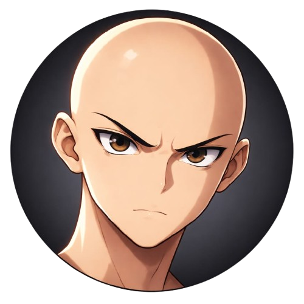

<!DOCTYPE html>
<html>
<head>
<meta charset="UTF-8">
<title>El Calvo Supremo 5.0</title>

</head>
<body>

<canvas id="game"></canvas>

<h1>ELIGE PERSONAJE</h1>

 

<h2>DIFICULTAD</h2>
<button class="diffBtn" onclick="setDifficulty('easy')">Fácil</button>
<button class="diffBtn" onclick="setDifficulty('medium')">Medio</button>
<button class="diffBtn" onclick="setDifficulty('hard')">Difícil</button>

Volumen:
<input type="range" min="0" max="1" step="0.01" value="0.5"
oninput="levelMusic.volume=this.value">

<h1 id="endText"></h1>
<button onclick="restartGame()">Intentar otra vez</button>

</body>
</html>
